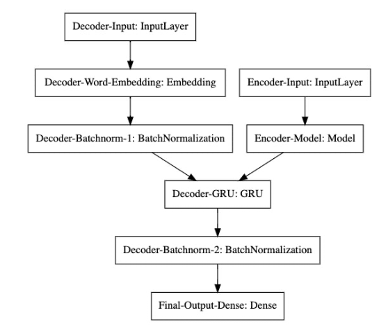

# Text Summarization of GitHub Issues

## What is it?

Using a dataset of GitHub Issues' titles, bodies and URLs, a Sequence to Sequence model is constructed with GRUs to summarize the GitHub issue body. The machine generated title is better and more compact than the actual user defined title.

Using approximate nearest neighbors search it also finds out the most closely related GitHub Issues by Euclidean distance. The Spotify ANNOY package is used for this purpose.

The model's BLEU score is also obtained.

*Note: Training the dataset for this model is computationally expensive owing to the large size of the [dataset](https://www.kaggle.com/davidshinn/github-issues) being over 8M entries.*

## Architecture

### Overall

### Layers

# Text Summarisation of Github Issues with NLP

GitHub Issues are known to be excessively long and complicated. It would be a great help to the community, if the issues could be summarized into a precise single  line description using Natural Language Processing.

## Dataset

The dataset can be found [here](https://www.kaggle.com/davidshinn/github-issues)
